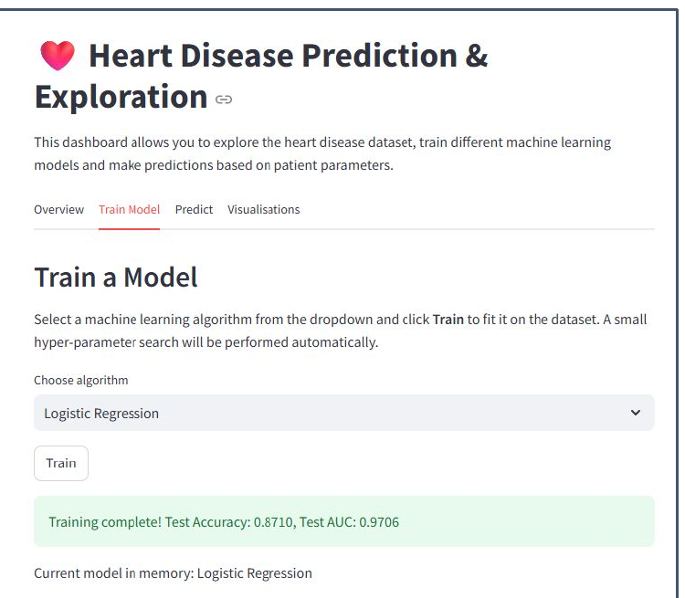
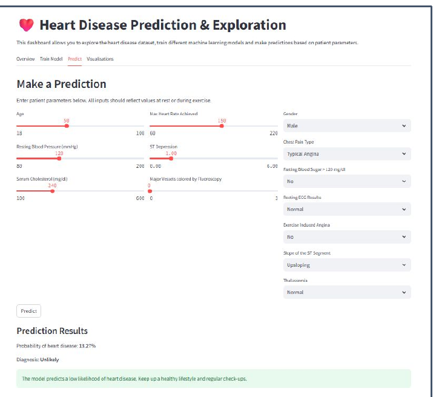
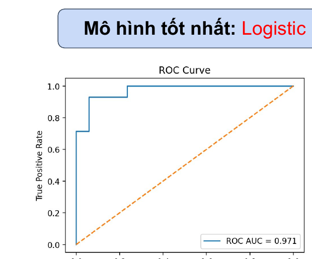

# Heart Disease Diagnosis — Model Comparison Application

A Jupyter/Colab notebook that builds and compares several classic machine learning models for **binary heart disease diagnosis** on the UCI **Cleveland Heart Disease** dataset, including a feature-engineering pipeline and a stacking ensemble.

[](https://colab.research.google.com/github/yen010390/Heart-Disease-Diagnosis-Model-Comparison-Application/blob/main/Project_3_2_Heart_Disease_Diagnosis_Model_Comparison_Application.ipynb)

## 🩺 Motivation

Cardiovascular disease is the leading cause of death worldwide, responsible for roughly 30% of annual deaths both globally and in Vietnam. Early and accurate diagnosis is critical for reducing risk. This project explores how far classic, lightweight ML models — and a simple ensemble of them — can go in predicting heart disease from routine clinical measurements.

## 📓 Overview

The notebook (`Project_3_2_Heart_Disease_Diagnosis_Model_Comparison_Application.ipynb`) walks through a full ML workflow:

1. Load and clean the Cleveland heart disease dataset.
2. Explore the data (correlation heatmap, pairwise distributions, scatter/regression plots).
3. Preprocess features (imputation, scaling, one-hot encoding) and build a second, **feature-engineered** version of the dataset.
4. Split into train / validation / test sets.
5. Train and tune four classic models — **Naive Bayes**, **K-Nearest Neighbors**, **Decision Tree**, and **K-Means** (used as a cluster-to-class classifier) — on both the original and the feature-engineered datasets.
6. Combine the three supervised models into a **Stacking Ensemble**.
7. Compare all models on validation and held-out test accuracy.

## 📊 Dataset

- **Source:** UCI Machine Learning Repository — [Cleveland Heart Disease dataset](https://archive.ics.uci.edu/ml/machine-learning-databases/heart-disease/processed.cleveland.data) (auto-downloaded by the notebook if not present locally as `cleveland.csv`).
- **Size:** 303 patients, 13 clinical features (`age`, `sex`, `cp`, `trestbps`, `chol`, `fbs`, `restecg`, `thalach`, `exang`, `oldpeak`, `slope`, `ca`, `thal`) + binary `target` (presence/absence of heart disease).
- **Split:** 80% train / 10% validation / 10% test, stratified by target (`random_state=42`) → 242 train / 30 val / 31 test.
- Pre-computed splits are also zipped and re-downloadable from Google Drive inside the notebook (`splits/raw_*.csv`, `splits/fe_*.csv`).

## ⚙️ Feature Engineering

In addition to the raw feature set, the notebook builds an **FE (Feature-Engineered)** dataset with:
- Polynomial (degree-2) expansion of numeric features
- Age binning (one-hot)
- Derived ratios: `chol_per_age`, `bps_per_age`, `hr_ratio` (`thalach / age`)

Both the **Original** and **FE** datasets are run through every model so their impact on performance can be compared directly.

## 🤖 Models Compared

| Model | Tuning |
|---|---|
| Naive Bayes (`GaussianNB`) | — |
| K-Nearest Neighbors | `k` selected by validation-accuracy sweep (`k = 1…20`) |
| Decision Tree | `max_depth` selected by validation-accuracy sweep |
| K-Means (clustering) | Cluster → majority-class mapping learned from `y_train` |
| Stacking Ensemble | Base learners: KNN + Decision Tree + Naive Bayes; meta-learner: KNN (`predict_proba` stacking) |

## 📈 Results

Test-set accuracy for each model, on the original vs. feature-engineered dataset:

| Model | Test Acc. (Original) | Test Acc. (Feature-Engineered) |
|---|---:|---:|
| Naive Bayes | 83.87% | 83.87% |
| KNN (k tuned) | 84.00% (k=5) | 81.00% (k=4) |
| Decision Tree (depth tuned) | 81.00% (depth=3) | 81.00% (depth=3) |
| K-Means (2 clusters) | 87.10% | 87.10% |
| **Stacking Ensemble** | 83.87% | **90.32%** |

**Key takeaways:**
- The **Stacking Ensemble on the feature-engineered dataset** gives the best overall result (90.3% test accuracy, 93.3% validation accuracy), outperforming every individual model.
- Feature engineering clearly helps the ensemble but has a mixed/neutral effect on the individual base models — KNN even performs slightly worse on the FE set (likely due to the added polynomial features diluting distance-based similarity).
- Naive Bayes, Decision Tree, and K-Means show **identical accuracy** on Original vs. FE datasets in the current notebook run — this is likely because those particular evaluation cells reused the same `X_train`/`X_val`/`X_test` variables instead of the `_fe` versions before being re-run for the FE case. Worth double-checking/re-running those cells with the `_fe` variables explicitly if you want to confirm the true FE effect for these three models.

## 🚀 How to Run

**Option 1 — Google Colab (recommended, zero setup)**
Click the "Open in Colab" badge above and run all cells top to bottom.

**Option 2 — Locally**
```bash
git clone https://github.com/yen010390/Heart-Disease-Diagnosis-Model-Comparison-Application.git
cd Heart-Disease-Diagnosis-Model-Comparison-Application
pip install numpy pandas scikit-learn matplotlib seaborn gdown
jupyter notebook Project_3_2_Heart_Disease_Diagnosis_Model_Comparison_Application.ipynb
```
Run the notebook cells in order — the dataset is downloaded automatically on first run (either directly from UCI or via the pre-built `splits/` archive on Google Drive).

## 📁 Repository Structure

```
.
├── Project_3_2_Heart_Disease_Diagnosis_Model_Comparison_Application.ipynb   # main notebook
└── README.md
```

## 🧰 Tech Stack

- Python, pandas, NumPy
- scikit-learn (`Pipeline`, `ColumnTransformer`, `StandardScaler`, `OneHotEncoder`, `PolynomialFeatures`, `GaussianNB`, `KNeighborsClassifier`, `DecisionTreeClassifier`, `KMeans`, `StackingClassifier`)
- matplotlib, seaborn (visualization)

## 🧪 Related Exploration: Streamlit Prediction Dashboard

As a separate, related exploration (AI Vietnam AIO2025, Module 4), a broader model comparison — Logistic Regression, KNN, Decision Tree, SVM, Random Forest, AdaBoost, Gradient Boosting, LightGBM, and XGBoost — was also tested, wrapped in an interactive **Streamlit** dashboard for training models and predicting risk from patient parameters. In that exploration, **Logistic Regression** was the best performer (ROC-AUC ≈ 0.97).

> **Note:** This dashboard is not part of the notebook in this repository — it's a separate prototype from the same broader project, shown here for reference only.

| Train a Model | Make a Prediction |
|---|---|
|  |  |



## 🔭 Future Work

1. Re-run the Naive Bayes / Decision Tree / K-Means evaluation cells explicitly against the `_fe` variables to confirm the true effect of feature engineering on each.
2. Try additional base learners in the stacking ensemble (e.g., Logistic Regression, SVM, gradient-boosted trees) to see if test accuracy improves further.
3. Cross-validate rather than rely on a single 80/10/10 split, given the small dataset size (303 patients).
4. Package the best-performing pipeline (Stacking Ensemble + FE) into a small predict function or simple app for interactive use.
5. Validate on external heart disease datasets (Hungary, Switzerland, Long Beach V) to test generalization beyond Cleveland.

## 📄 License

This project is for educational purposes.
